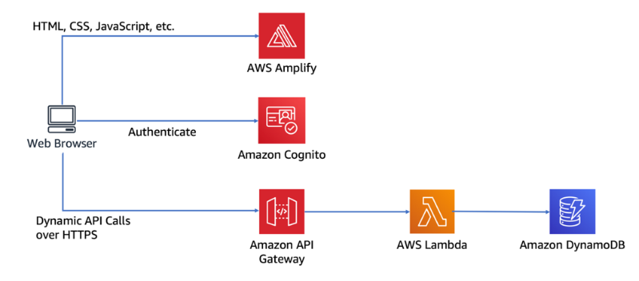

<h1>Wild Rydes</h1>

The project is application for setting unicorn ride. It was developed following [this AWS tutorial](https://aws.amazon.com/getting-started/hands-on/build-serverless-web-app-lambda-apigateway-s3-dynamodb-cognito/). The application architecture uses AWS Lambda, Amazon API Gateway, Amazon DynamoDB, Amazon Cognito, and AWS Amplify Console and arcgis. 

<h1>Serverless</h1>
❖ easy to deploy- A serverless approach for your application could be perfect. If you need to spin up an app fast, serverless might be your solution. Instead of weeks and months to deploy an app, you can do it within hours and days. The reason behind this is that you don’t have to concern yourself with infrastructure. You can focus on the code and release it immediately. Scalability is automatic and you don’t have to worry about any provisioning needs. 
❖ Low cost 
❖ More Time For UX 
❖ Better scalability 
❖ Improved flexibility 

